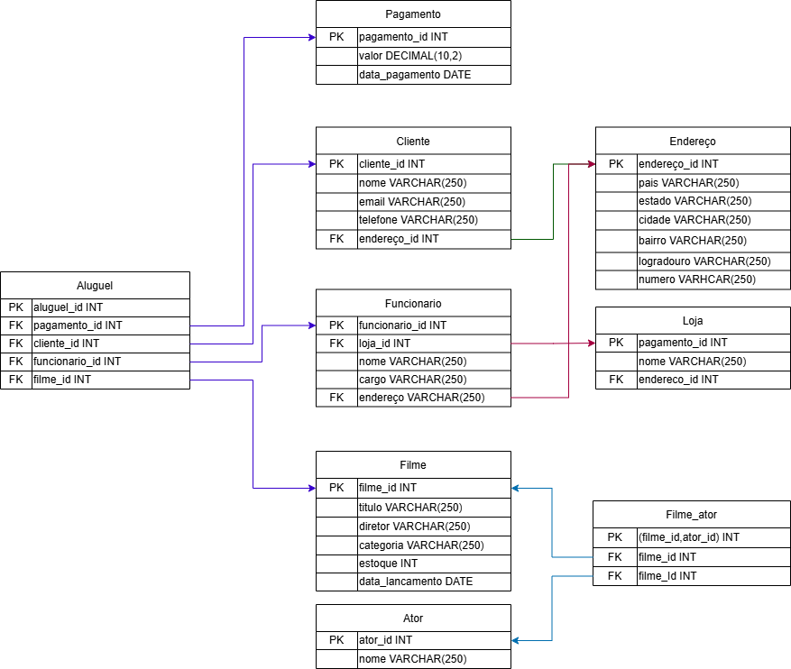

# Trabalho Final de Banco de Dados - AFYA 6° Periodo

Integrantes: Tales Coutinho Carlos e Pedro Henrique Barbosa de Sousa.

Este projeto apresenta a modelagem de um banco de dados para uma locadora de filmes. A estrutura foi definida em SQL e contempla o cadastro de filmes, clientes, enderecos, lojas, funcionarios, atores, pagamentos e alugueis.

## Objetivo

O objetivo do banco de dados e organizar as principais informacoes de uma locadora, permitindo registrar:

- Filmes disponiveis para aluguel.
- Clientes cadastrados.
- Enderecos associados a clientes, funcionarios e lojas.
- Lojas e seus funcionarios.
- Atores participantes dos filmes.
- Pagamentos realizados.
- Alugueis feitos pelos clientes.

## Arquivos do projeto

- [Construção.sql](Construção.sql): Contem a criação inicial das tabelas e inserções iniciais.
- [Consultas.sql](Consultas.sql): Consultas de teste para o banco de dados.
- [DicionarioDeDados.md](DicionarioDeDados.md): descreve as tabelas, campos, tipos de dados, chaves e relacionamentos do banco.
- [Diagrama.png](Diagrama.png): representacao visual do modelo do banco de dados.

## Estrutura geral do banco

O banco de dados e composto por 9 tabelas:

- `filme`
- `endereco`
- `cliente`
- `loja`
- `funcionario`
- `ator`
- `filme_ator`
- `pagamento`
- `aluguel`

## Relacionamentos principais

- Clientes,funcionarios e lojas estão relacionados a um endereço da tabela endereço
- A tabela `filme_ator` possui relacionamento N:N entre filmes e atores,dessa forma atores podem se relacionar com varios filmes e filmes podem ser relacionar com varios atores.
- Um aluguel relaciona cliente, filme, funcionario e pagamento.

## Diagrama

.

## Dicionario de dados

As informacoes detalhadas sobre cada tabela estao disponiveis em [DicionarioDeDados.md](DicionarioDeDados.md).

 ## Ferramentas utilizadas
 - [Visual Studio Code](https://code.visualstudio.com/) para escrita da documentação e código.
 - [MySQL Workbench](https://www.mysql.com/products/workbench/) para executar os códigos e visualizar consultas com interface gráfica.
 - [Draw.io](https://www.drawio.com/) para representação visual do diagrama.
 ## Referencias utilizadas
 - [W3Schools](https://www.w3schools.com/mysql) para consulta de documentação.